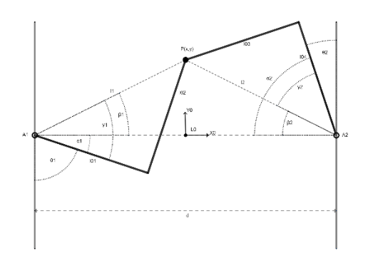
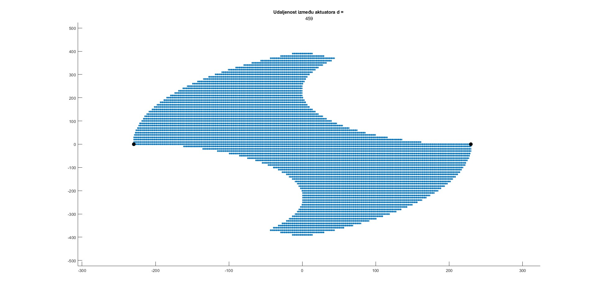
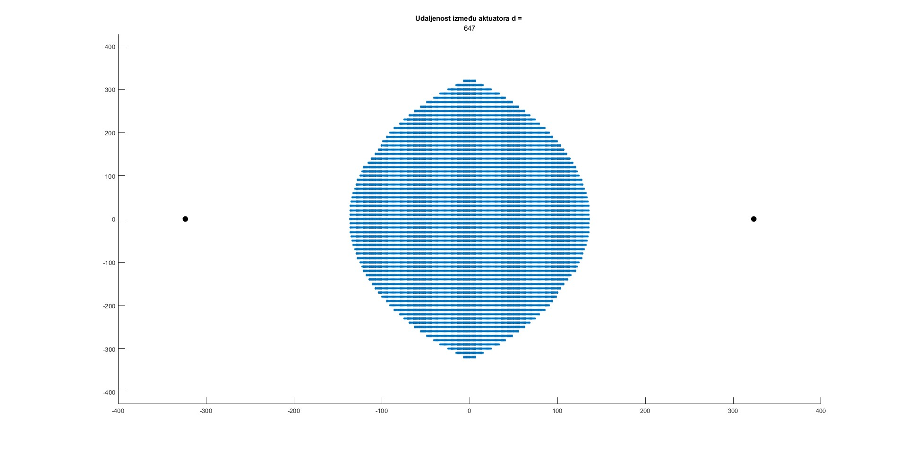
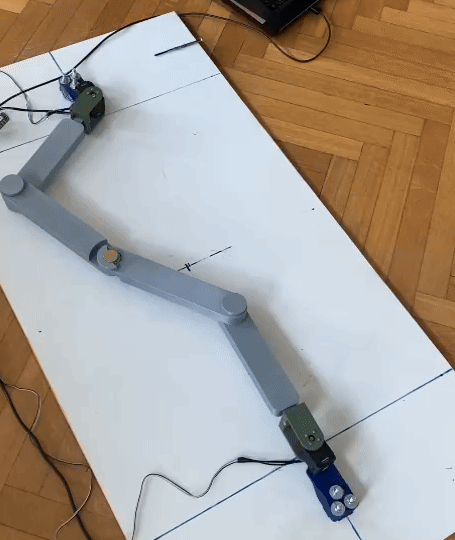

# Creation of a planar parallel structure for centroid vectoring of a robot with a floating base

### Course : Seminar 2

In this project, a planar parallel mechanism with two degrees of freedom is described. The inverse kinematics procedure was used to obtain expressions for the rotation angles of the actuator depending on the given position of the tooltip. Furthermore, the problem of determining the working space with the set requirements of centroid vectorization is described. The obtained conclusions were tested on the made model of the mechanism. Although the control of systems using planar parallel mechanisms is already widely used in various fields, the use for the centroid vectoring by controlling the position of the center of mass of the system is a new concept under investigation. In the next steps, it is necessary to create the mechanism control and then implement it on real robots in order to examine the advantages and disadvantages of the control of the stabilization of robots with a floating base compared to the currently used methods.

Sketch for inverse kinematics calculation:



## Execution

### Matlab script for calculating the optimal length of mechanism articles:
```
optimal_bar_lengths.m
```

### Matlab script for calculating the working space of the mechanism:
```
seminar.m
```

## Results

#### Results can be found i `Documentation/report.pdf`report





## Real life model of the mechanism in action

At the end of the project, a real-life model of the mechanism was made. The mechanism was made using a 3D printer and the control of the mechanism was done using a Dynamixel motors. The mechanism was controlled using the inverse kinematics calculations and the working space of the mechanism was tested. The mechanism was able to move the tooltip in the desired direction and the working space was tested for the given requirements.




## Credits

#### [&copy; Faculty of Electrical Engineering and Computing, University of Zagreb, 2023](https://www.fer.unizg.hr/)

#### [&copy; Laboratory for Robotics and Intelligent Control Systems, University of Zagreb, 2023](https://larics.fer.hr/)

&NewLine;

Contributors names and contact info

Author|GitHub | e-mail
| :--- | :---: | :---:
Enio Krizman  | [@kr1zzo](https://github.com/kr1zzo) | enio.krizman@fer.hr

Mentors | e-mail
| :--- | :---: 
Izv. Prof. Dr. Sc. Matko Orsag  | matko.orsag@fer.hr
